```{r setup, include=FALSE, out.width = 400}
knitr::opts_chunk$set(echo = TRUE, cache = TRUE, fig.pos = 'H',
                      fig.width = 8,
                      fig.height = 11,
                      fig.asp = 0.5)


library(png)
library(grid)
library(dplyr)
```

## Introduction

This paper is to describe our contributions to the final project of analyzing the profitability of movies based on various factors, which was conducted jointly by Wenjun Zeng, Guanghong Fu, Rongzhao Huang and Yin Bian from June 30 to August 9. The paper highlights the bottom up approach to determine the most important driving factors, some basic statistical tests to understand the mechanism underlying the effect of some variables like the popularity of actors, the art of directors, the net budget, genre selection, releasing date, and the ratings estimation from the beginning, on the profitability of movies.

Problem Identification

More and more people are willing to spend their free time watching a movie outside with their families or friends. However, consumers have different preference based on their incomes, geographies and their own favor for certain celebrities. To exploits this preference sensitivity, investors of those movies wish to know what factors make their product widely accepted; To achieve an appropriate estimate of revenue for a new movie, analysts wish to have a clear map of customer specific factors (favorite stars, spending behavior) and other factors like budgets as inputs on which they can build price predicting software products. Therefore, in this project, we attempt to identify how the gross revenue of a movie is influenced by some crucial factors like the date of release, the popularity of the leading actor and actress, the art of the director and the budgets the investors wish to put at the beginning. 

Our data source, IMDB is a website that can incorporate almost all the potential insights that we want to take into considerations. In this project, we only focus on a specific task of scraping, wrangling and analyzing the data form IMDB to draw a tentative conclusion about how we can predict the popularity of a movie based on those potential parameters although the ultimate broader goal is to possibly develop stress testing models for movies on the existing economic scenario. These stress test models are crucial as they enable both investors and consumers to answer the question like “What would happen to movies if the director invite James Cameron to be a leading actor in their new movie?” And design their operations accordingly.

## Data Collection

Scraping the websites
  
  We scraped our data set from IMDB. We divided our data scraping work into two steps. First we scrape through lists of movies and fetch all the links to the movies we want. IMDB keeps its own list of films as "Top 250 Rated Films" and "Top Films by Genre". But to get on the lists a movie must have at least 25000 votes. All these lists add up to roughly 10,000 movies links. However, we observed that most of movies have three or more genres, which means we can only get around 3000 movies after removing all the duplicates. So we looked for some other websites that may keep links of movies at IMDB. Douban Movie is the Chinese version of IMDB, which keeps data about all movies in Chinese. It has lists of movies by genre and year, and the lists are almost exhaustive. For each movie record, Douban not only keeps information about films, but also a link to the film's page on IMDB. We opened a page like the one below to catch all the movie links. We specified the year to be each year during 2000 to 2015, and we added a tag ???USA???, so that we get mostly movies here.  To go through all pages of the list, we changed the number after "start=" to be 20, 40, 60, etc. Then we run through all movie links on Douban, to locate and fetch the IMDB link of each movie, and we have all links to movies on IMDB. To filter out some really unimportant ones we only selected the top 1000 films each year. After we have all the links, we run through all the links to fetch the data from IMDB. In data cleaning, we did some format parsing, and currency exchange for budget data that are not in USD. 
  
## Most Frequent Words

  To start out with, we want to have a brief direction of where we should be heading and what???s popular in the field of movies. We can observe the popular keywords in the movies. From the most popular words of 2000 to 2015, we are seeing some really typical keywords of movies, such as love, murder, and friend. Not really surprising. But if we look at the keywords year by year, we start to see some interesting trends. In year 2000 to 2010, the most popular keywords are all quite classical keywords. In recent years, however, we are seeing some interesting keywords such as ???based on true story??? and ???box office flop???. I think this indicates that with the advance of Internet and online streaming services, people are not really interested by traditional elements for a good film. Rather than well-plotted love and hates, they would like to see more surprises or more real life related plots. 

## Director

  The first thing of producing a movie is to find a director. But who should we choose in order to make a profitable movie with only limited amount of budget. To answer that question, we need to plot a graph of average budget that each director spent when making a movie versus the average gross of all the movies directed by each director. For the cleaning process, we first selected the budget, gross, and director columns from the "movies_imdb.csv" data frame. Then we grouped by the name of the director and used summarize function to calculate the mean of the budget and the gross for each director. The following graph is what we got when we only choose the top200 directors according to the gross they make with their movies.
  
  Let's take a step back. Intuitively, without looking at the graph, one would probably choose some big names to be the director of his movie, such as Christopher Nolan, Peter Jackson, George Lucas, and James Cameron. All of these directors have made incredible movies and create history in movie box history. But since we are aiming to produce a fairly profitable movie, we need to choose a director who uses least amount of budget with the guarantee of the gross of the movie, which in this case should be represented as points located at the upper left portion of the graph. From figure-1, some of our potential candidates could be Pierre Coffin who directed all three "Despicable Me", George Lucas who is famous for producing and directing the "Star Wars" series, and James Cameron who directed "Titanic", and "Avatar". Figure-2 shows that when we only have about 120 million budget, we should choose James Cameron over Christopher Nolan. Similarly in figure-3, if we want to make a movie that has gross around 350 million, we should choose Pierre Coffin over David Yates who directed "Toy Stories", "Finding Nemo", and "Monster, Inc." 
  
  To conclude, the factor of director does have an influence on the gross of the move. Although, in general, directors who spent more money tend to make high box movies, yet there are still many talented and famous directors who are able to use only limited amount of money to create box miracle.

<div style="width:600px; height=400px">
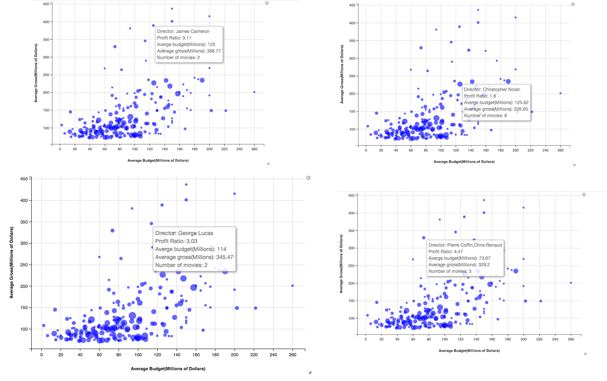
</div>

## Stars

  The next variable we are going to explore is the factor of actor/actress. Similar to what we did to the director data, we are going to do almost the same thing to the actor/actress data. However, the actor/actress data we collected from imdb are composite, which means all the actors/actresses from a movie are combined to a string. Therefore, what we did is that we first use str_split function to separate the each entry of actor/actress information then unique the vector we got in order to get all the actor/actresses that cast in the movies we collected from imdb. Then we did the same thing as we did to the director data to get the following mean budget versus mean gross graph, in which each point represents a movie star. The graph only shows the top200 movies stars according to their mean gross.
First of all, let's compare the cleaned movie star arranged in descending order of mean gross with some online data--top 100 stars in leading roles at the worldwide box office. From this out side data we can see that Tom Hanks, Robert Downey, Jr., Johnny Depp, Daniel Radcliffe (Harry Potter) ranked very high in the table. We pulled the data from the website, and merged with the data we generated and cleaned. Although the rank are somehow different (not a huge difference), movies stars who rank high in the online source data also rank high in our actors/actresses data. The reason that there is some differences in the ranking is that first our data calculates the mean gross of each movie star, while the online data calculates the sum. Another reason is that out data only contains top1000 rated movies from year 2000 to 2015. But in general, our data is consistent.
  
  Figure shows some top actors/actresses whose movies have high gross but also require high budget, for example, Johnny Depp who is famous for starring Captain Jack Sparrow in the "Pirates of Caribbean" series, Robert Downey Jr. who is famous for starring Tony Stark in the "Iron Man" series, and Hugh Jackman who is famous for starring Logan in the "Wolverine" series. However, in order to produce a profitable movie we are looking for movie stars who located in the upper left portion of the graph just like what we expected for directors. Therefore, figure-2 shows some ideal actors/actresses that we could choose, for example Steve Carell who is famous for starring in the recent movie "The Big Short", Bradley Cooper, who is famous for starring in "American Sniper", "Guardians of the Galaxy" and the "Hangover", and Cameron Diaz who starring in "Sex Tape" and the "Shrek" series.
  
  In general, movie stars does have a huge effect on the box office. Famous movie stars tend to help the movies they starred to gain earn more.

<div style="width:600px; height=400px">
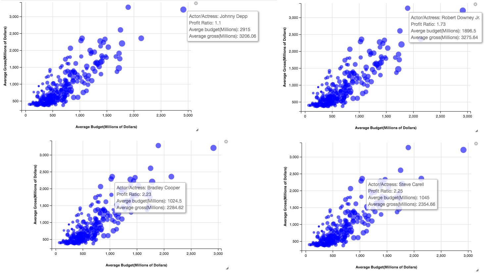
</div>

## Genre Filtering

  In order to produce a profitable movie, not to mention the kind of “most profitable”, we have to think about three factors: the popularity of the genre, the average profit ratio of the genre, and the consistency of the profit ratio of the genre. The first factor implies that the number of people would like to watch the movies; the second factor indicates the rate of return; the third factor serves as an indicator of risk, which could be considered as the risk evaluation factor. 
  
  Popularity
  
  In terms of the popularity of the genre, it means that we have to produce a kind of movie in audience’s favor. In a general sense, we have to think about what the most popular genre is. In this case, we can just look at how the percentage of each genre falls into Top 100 in IMDB and changes over years.
  
<div style="width:600px; height=400px">
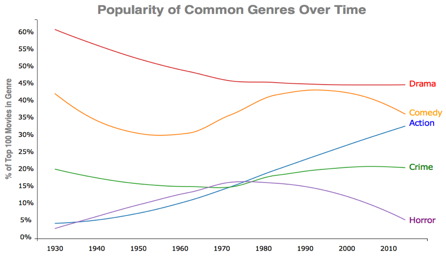
</div>

  Dan Kopf, Priceonomics; Data: IMDB (due to the limitation of our scraped dataset, we are using this plot from outside source, but it aligns with our discovery in our data set as well, as you will notice in later discussion)


  As we can see, dramas are gradually declining in popularity throughout the years. As the entertainment industry gets more diverse, the percentage of dramas available gets diluted. Nevertheless, dramas still play a major role these days. Dramas are running into a decreasing fashion because the majority of movies during the early last century were made of dramas, as the industry gets more diverse, the percentage of dramas gets diluted; nevertheless, dramas still play a huge role these days, as we will observe very soon. Secondly, the percentage of comedies is fluctuating over past eighty years and getting close with the Action for an obvious reason. Despite the trend of crime movies and the horror movies due to their deficiency in popularity (less than 20%), the action movie has been climbing not only steadily, but also substantially since the movie industry has emerged last century. 
  
  After closely looking into the dataset we collect, we found that most movies on IMDB fall into more than one genre. In fact, 83% of the films in our dataset are assigned to more than one genre; therefore, it is more appropriate to classify those action movies as movies with action on IMDB. As we randomly select some entries that are classified as action genre in our dataset as below: 

<div style="width:600px; height=400px">
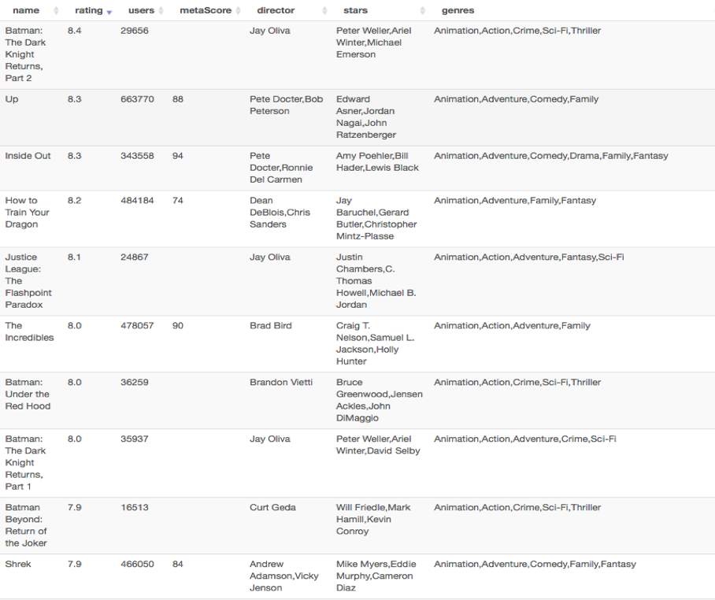
</div>

  We realized that action movies are no longer “007 series”, “Mission Impossible”, Sly Stallone style action flicks, Jackie Chan's Chinese Kung Fu, or Jason Bourne Legacy nowadays. Instead, it is more like “Big Hero 6” and “Kung Fu Panda”, as part of the genre because there are some “actions” involved. The definition and the idea of the action movies have been evolving over decades. It is transforming into a more multiform combination rather than a singular condiment during the last decade. But why’s that? What makes action movies so special? 
	
	Profit Ratio
  
  As we further researched for this specific question, hoping to draw some connection between profit and genres, we introduce a new variable called profit ratio. We define profit ration to be the gross budget ration in this case. Interestingly, we have found the answer lies within the change of the whole movie industry. To be more specifically, the change in target audience, audience expectation, and technology. The text of movies has been changed over time. First, to extend the range of potential audience, the media institutions and producers need to consider about the attraction of the movies to people from different races, genders, and social classes. For example, most action movies were violent and thrilling. To target at young audience, some animated action movies came out. For instance, Kung Fu Panda is one of those animated action movies, which involves the element of Kung Fu and also attracts young people. Furthermore, some women, who might be the decision makers in a movie dating, are not interested in action movies. Producers add romantic story lines to increase female audience’s utility of action movies. Meeting the target audience's preference is a way to make the action movies more profitable by increasing the demand.

  The expectation of audience is the second factor that changes the text of both action and animation movies.  Since the rise of the movie field, audiences are familiar with the convention of different genres of movies. There has been a mind-set in audience’s expectation of new movies. However, people are also looking for fresh elements in movies, which could lead to considerable box office. Compared with other kind of genres, it is easier to make a breakthrough in action or animation movies because audience usually enjoy in the visual impact instead of the story line. As a result, more media institutions and producers chose to make action or animation movies. Keeping the audience’s curiosity could also make the movies profitable by making sequel. If people watched the first movie, they expected that the following-up movies have the same convention and are eager to watch the sequel due to their curiosity. As a result, the producer of the movie could focus on improving the visual arts, which people are excited about. 
  
  The third influence of the change of texts in both action and animation movies are technology.  Due to the significant development of technology, the cost of both action and animation movies becomes relatively lower. Currently, technology could substitute for some human resource, transportation, and propos. For instance, computers are necessary in movie production, which could function as digital media designers, VFX artists, who make special visual art for movies, and film cutters. As a result, the computers could save the spending on human resource. Seeing the huge profit in both actions and animation movies, more and more media institutions and movie producers turn to produce action or animation movies. 
  
  The expansion of target audience increases the demand of action and animation movies by meeting preference of people from different groups.  The audience expectations and technology motivates more producers to do action movies because of the easy way to meet people’s curiosity and the relatively low cost.  As a result, the action movies and the animation movies became wise choices for most movie producers. 

Profit Ratio Consistency / Risk Evaluation

  After the analysis and the research we did in previous two chapters, we have narrow down the whole genre list into a tuple, whether we should produce an action movie, or an animation movie? In order to make the best choice base on our analysis of the dataset we scraped, we now involves the third factor, the risk. From just comparing at the first and second figure rendered from our dataset, it appears that produce an action movie seems to be a wiser choice, but is that really the case?

<div style="width:600px; height=400px">

</div>

  From just looking at the general trend, the action genre appears to be more stable than the animation genre in terms of the smooth line, which indicates a higher, more stable profit ratio. Nevertheless, by calculating the residue-square of the linear regression (not shown in graph for simplicity, but numbers are given for reference), we also noticed that in action genre, gross and budget actually has higher residue-square, in another word, budget and gross has more correlation in action genre than in animation genre. 
  
  Although in general, action genre has better profit ratio and profit trend, we should not jump into the conclusion that making action movies is profitable for sure. After all, there are still tons of action movies lose money all the time. Under this consideration, we decided to involve another variable, the standard deviation of the profit ratio of each genre. An intuitive way to interpret this variable would be the probability of following the original profit ratio slope. 

<div style="width:600px; height=400px">
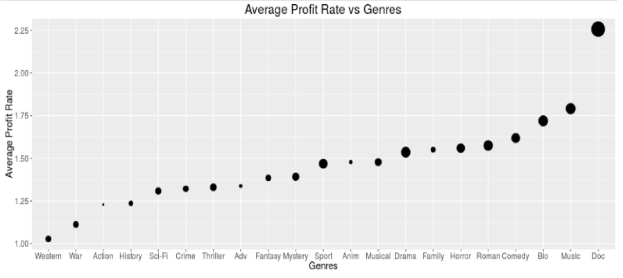
</div>

  In the above figure, the size of the dot represents the standard deviation, the bigger the dot is, the larger standard deviation. What does a larger standard deviation mean? Is it a good thing? As we can see, the dot that represent action genre is obviously smaller than the animation genre. It is bad? No. It is not. A standard deviation implies the stability of following the profit ratio trend in that specific genre. The larger standard deviation we have, the movie we produce is less likely to follow the general profit ration trend of that genre. To sum up in one word, it’s not only less risky to invest in action genre rather than animation genre, but also the rate of return is more consistent. 

## Timing
	
After the genre is determined, we decided to play with our dataset to see if there are any less intuitive factors would contribute to the profit ratio, so that we can take advantage of this factors by fixed the variables in our favor. Interesting, we did have some discovery relates to the timing when we release the movie. However, funny enough, it is very random and hard to come up with a reasonable explanation. Our discovery relates to release timing lies into below two figures. 
	
<div style="width:600px; height=400px">
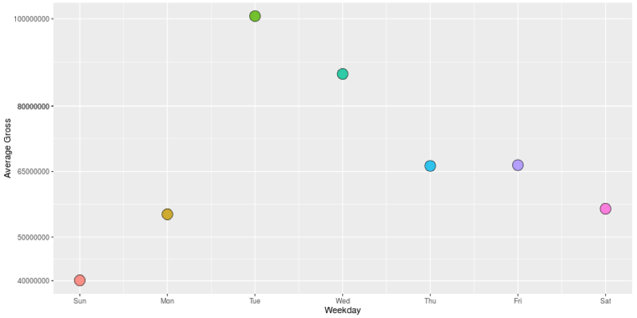
</div>
<div style="width:600px; height=400px">
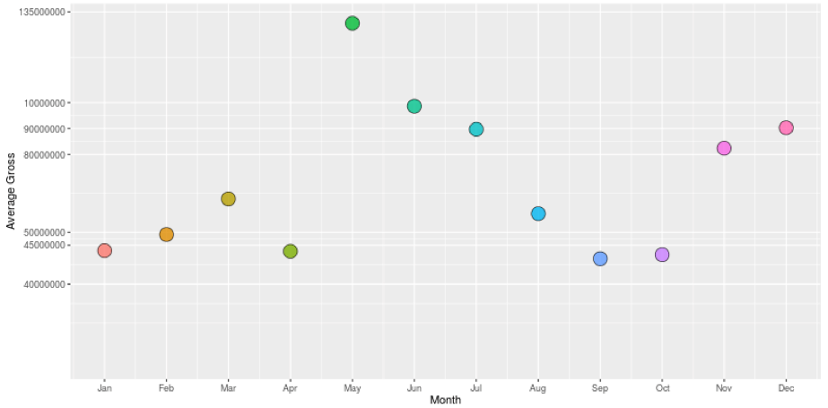
</div>

## Ratings

  Having decided on directors, stars, and what genres of movies are popular, we want to find out the relationship between audiences??? thoughts about a film and the film???s box office. In our dataset, we have the ratings on IMDB and how many people gave that rating. The number of ratings a film get on IMDB is an indicator of how many people know about and care about this film. Since box office are mainly concerned with how many people went to see the film, we expect to draw some connections between number of people that rates a film and the actual box office of that film. And of course, rating score is also an indicator of audiences??? opinions towards a movie. Despite that there exists a number of commercially successful movies that are not highly rated, such as Warcraft, people would generally expect higher rated movies to receive higher box office. People usually consults websites like IMDB for good films to watch, so intuitively receiving a higher review would help the box office. We also included the Meta Score, which is also a kind of rating from metacritic. For the following discussion, we separate our movie data sets into low budget movies, which are movies with budget of lower than twenty-five thousand dollars, and normal/higher budget movies. There is no wide-acknowledged cutoff for low budget movies. This cutoff is given by Stephen Follows in his study carried out in UK on film professionals. 

  For low budget films, there is almost no association between number of ratings and box offices, while for higher budget films, there is clear indication that higher number of ratings leads to higher gross. We start with plotting the number of ratings against the gross box offices of films.

<div style="width:600px; height=400px">
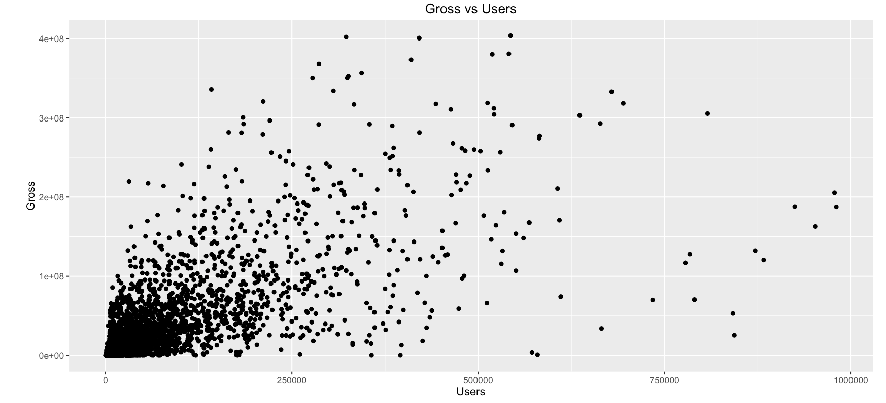
</div>
  
  Each dot represent a movie. This graph lacks proper association between these two variables. We can see the rough trend of more number of ratings leads to higher box offices. The main problem with this graph is that lots of dots are cramped on the lower-left corner. So for this graph, we have two things to do. We need to separate the data so that they do not appear as a whole black area on the graph, and we need to find out any possible relationships between the number of ratings and gross. For separating the data, we consider separating low-budget films out. We can draw two separate graphs for low budget films and comparatively higher budget one. Plus, for the higher budget group, we want to observe that there is a general trend of number of ratings being proportional to gross. To show this, we group the films according to their number of ratings into seven groups and draw two box plots. The width of each box is proportional to the square root of number of films in this group. 

<div style="width:100px; height=400px">
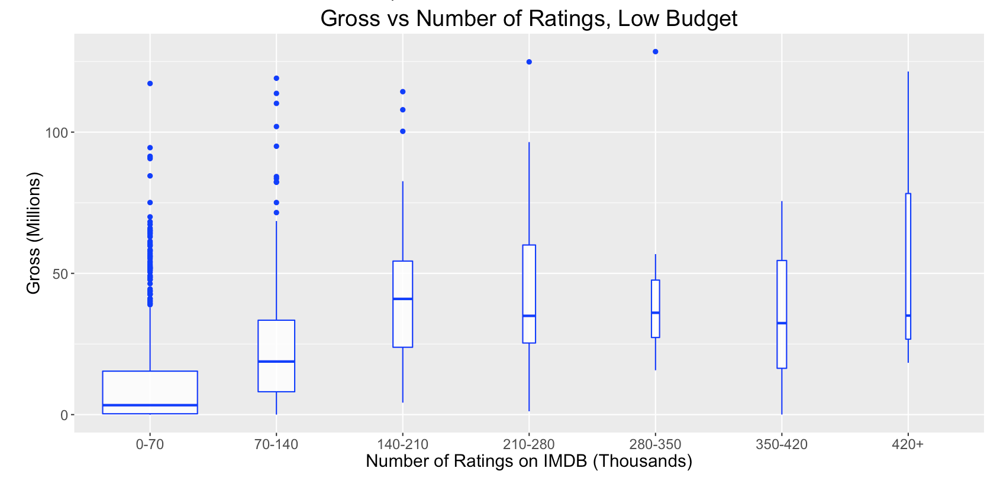
</div>
<div style="width:600px; height=400px">
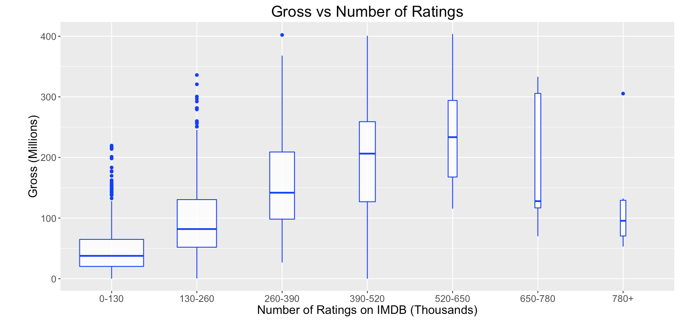
</div>
  
  From these two plots, we can see quite clearly that for the low budget films, there is still quite little correlations between gross box office and the number of reviews. Most of low-budget falls into the ???no one care??? group where they receive quite limited reviews and gross. The seven mean lines of the seven box plots take on a snake shape. This lack of correlation can also be seen from the linear regression line of the low-budget films. 

  Gross = 0.1561 * NumberOfReviews + 7878369, R-squared = 0.2276

  The R-squared value is quite low. On the other hand, for the higher budget group, the boxplot clearly demonstrates that higher number of ratings is associated with higher gross. 
We can get a linear regression line of 

  Gross = 0.3402 * NumberOfReviews + 31424041, R-squared = 0.4096

  For the movies that received zero to six hundred and fifty reviews, the growing trend is quite obvious. We have a r-squared value of 0.41. Although the correlation is still quite limited if we only look at the number, this factor is quite worth noticing given that box office is generally not easy to predict. Consider budget, which is probably the most important factor to consider for people who invest in films, only has a r-sqaured value of around 0.5. It is worth noticing that for the last two groups, we are seeing obvious drops in gross with increasing number of ratings. This might just be coincidental, because we are having much less sets of data about these two groups since they are usually big titles. Or this could be people tend to comment on bad movies which can thus explain the phenomenon. But in general this part of the graph does not give us too much information, if we want to generate more precise conclusion we need to do a hypothesis test or need to find more evidence to prove our guess. 


  We can see similar traits in ratings on IMDB. The correlation between ratings and gross are more substantial for higher budget films than low budget films. From the following boxplot, we can clearly see that for low budget films, they do not earn much regardless of their ratings, except for a couple of extreme outlier. On the contrary, for the higher budget films, the gross is very proportional to the rating on IMDB. We can draw similar graphs for gross vs Meta Score and observe very similar trend. The reason for this phenomenon might be that people look at the rating of the movies they are interested before they actually watch them in the theater. Also we can see that, in the middle range of the rating scale, the variance is larger and there exits more outliers. This could be the reason that some movies are the second or third movie in a series, in which the first one achieves great success. Audiences may as well follow up for the second or third episodes even if the movies are not as good themselves.

<div style="width:600px; height=400px">
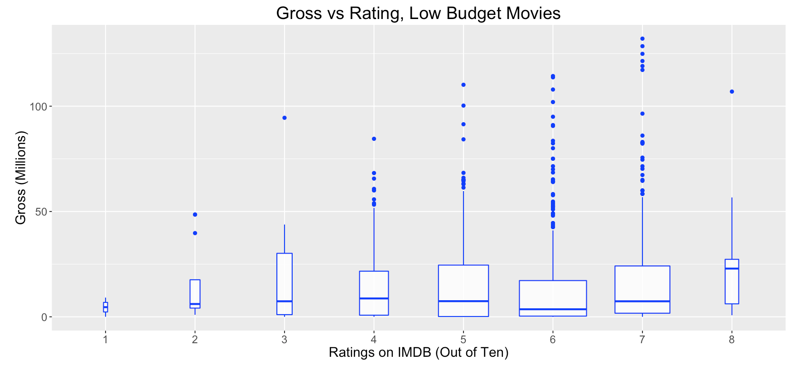
</div>
<div style="width:600px; height=400px">
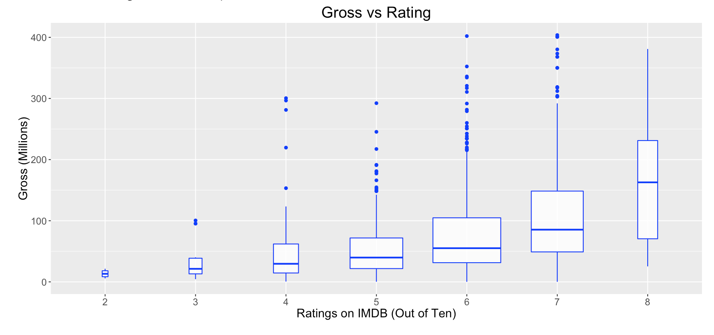
</div>

  In fact, we cannot find out any clear relations between lower budget films and ratings nor number of ratings. In other words, it may be risky to make a low budget movie even though the low budget seems to be having a lower threshold to enter. For normal budget movies, audiences??? preferences affect the gross box office almost as efficiently as budget, and is definitely worth taken care of. If one is investing in a movie costing more than twenty-five millions of dollars, proper publication and advertisements are definitely needed. Actually, in 2012, Google published their model in estimating the box office of a film before the movies came in theater. They also wanted to look into what factors that reflex audiences??? opinions, but they took a different approach. They looked at the relationship between number of film related searches and box offices. In fact, doing a simple linear regression on these two variables would generate a R-squared value of 0.7, which is far better than what we could do. Ultimately, using the the volumes of trailer related search, together with some minor tweaks, they could reach a 94% accuracy in predicting a movie???s box office four weeks prior to on theater. This is clearly a demonstration on the importance of advertising in the field of films 

## Conclusion
  
  We are aware of that you probably could not wait any longer to go produce a profitable movie after you finish such long read. However, we still like to conclude our finding after the analysis of our dataset. In order to produce a movie, if you have a high budget, you should focus on publication and find a way to achieve high rating at the first box week. If you budget is relatively low, you should focus on the selection of directors, actors, actress and the genre itself. Lastly, release it on a Tuesday in May no matter what. 


Reference:

[Follows, Stephen. "What's the Average Budget of a Low or Micro-budget Film?" Stephen Follows Film and Education. N.p., 2014. Web. 10 Aug. 2016.](https://stephenfollows.com/average-budget-low-micro-budget-film/)

[Panaligan, Reggie, and Andrea Chen. Quantifying Movie Magic with Google Search. Mountain View: Google Whitepaper, June 2013. Pdf.](https://ssl.gstatic.com/think/docs/quantifying-movie-magic_research-studies.pdf)

[ShinyApp](http://hrzlvn.shinyapps.io/movies)


